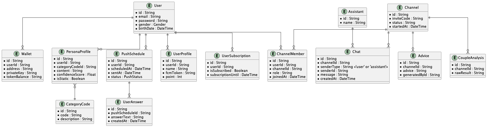
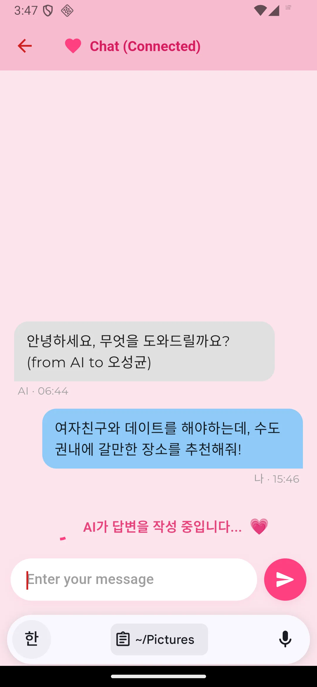
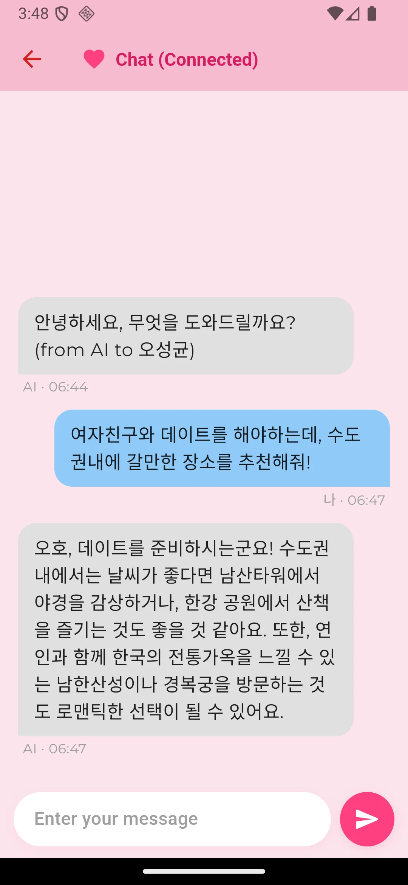
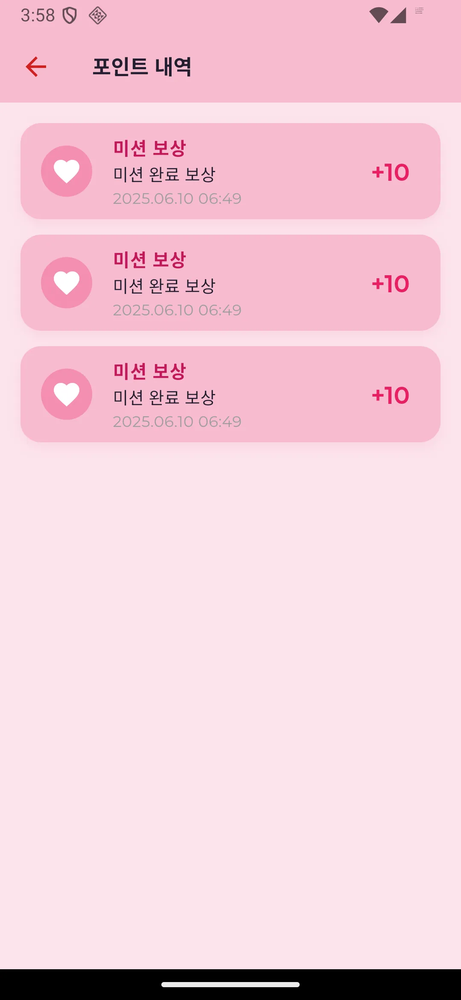

# Saiondo

**Saiondo**는 연인/커플의 대화와 성향을 분석하여 맞춤형 조언을 제공하는 AI 기반 커플 케어 서비스입니다.

---

## 🏗️ 프로젝트 구조

```
saiondo/
├── backend/
│   ├── api/
│   │   ├── prisma/
│   │   ├── src/
│   │   ├── test/
│   │   ├── puml/
│   │   ├── node_modules/
│   │   ├── Dockerfile
│   │   ├── Dockerfile.dev
│   │   ├── docker-compose.yml
│   │   ├── package.json
│   │   ├── yarn.lock
│   │   ├── README.md
│   │   └── ... (기타 설정/환경 파일)
│   ├── llm/
│   │   ├── src/
│   │   ├── venv/
│   │   ├── puml/
│   │   ├── docs/
│   │   ├── Dockerfile
│   │   ├── Dockerfile.dev
│   │   ├── requirements.txt
│   │   ├── README.md
│   │   └── ... (기타 설정/환경 파일)
│   ├── buildspec.yml
│   ├── deploy.sh
│   ├── docker-compose.yml
│   └── README.md
├── frontend/
│   └── app/
│       ├── lib/
│       ├── assets/
│       ├── test/
│       ├── android/
│       ├── ios/
│       ├── macos/
│       ├── linux/
│       ├── windows/
│       ├── web/
│       ├── pubspec.yaml
│       ├── pubspec.lock
│       ├── README.md
│       └── ... (기타 설정/환경 파일)
├── infrastructure/
│   ├── terraform/
│   │   ├── environments/
│   │   ├── global/
│   │   ├── modules/
│   │   ├── scripts/
│   │   ├── puml/
│   │   ├── docs/
│   │   ├── README.md
│   │   └── ... (기타 설정/환경 파일)
│   ├── puml/
│   ├── docs/
│   ├── .idea/
│   └── README.md
├── web3/
│   ├── contracts/
│   ├── scripts/
│   ├── artifacts/
│   ├── cache/
│   ├── node_modules/
│   ├── puml/
│   ├── hardhat.config.js
│   ├── package.json
│   ├── package-lock.json
│   ├── yarn.lock
│   ├── README.md
│   ├── env.sample
│   └── ... (기타 설정/환경 파일)
├── docs/
│   ├── images/
│   │   ├── api/
│   │   │   ├── architecture.png
│   │   │   ├── domain_infra.png
│   │   │   └── erd.png
│   │   ├── llm/
│   │   │   └── architecture.png
│   │   ├── web3/
│   │   │   └── architecture.png
│   │   ├── infra/
│   │   │   ├── dev-architecture-full.png
│   │   │   └── prod-architecture-full.png
│   │   └── app/
│   │       ├── architecture_component.png
│   │       ├── 4-6-1.webp
│   │       ├── 4-6-2.webp
│   │       ├── 4-6-3.webp
│   │       ├── 4-6-4.webp
│   │       ├── 4-6-5.webp
│   │       ├── 4-6-6.webp
│   │       └── 4-6-7.webp
│   ├── readme_web3.md
│   ├── readme_business.md
│   ├── readme_dev.md
│   └── ... (기타 문서)
└── README.md
```

---

## 🚀 주요 기능

- **AI 기반 커플 대화 분석 및 맞춤형 조언**
- **1:1 대화방, 성향 분석, 리포트 제공**
- **OpenAI/Claude 등 LLM 연동**
- **Flutter 기반 모바일/웹 앱**
- **REST API, 인증, 결제 등 지원**

---

## 🖼️ 시스템 아키텍처 (API)

<p align="center">
  
</p>

> **설명:**  
> NestJS 기반의 REST API가 도메인별로 분리되어 있으며, LLM 서버와의 연동 구조도 포함되어 있습니다.

---

## 🖼️ 도메인 & 인프라 구조 (API)

<p align="center">
  
</p>

> **설명:**  
> API 서버의 주요 도메인(사용자, 관계, 채팅 등)과 인프라(데이터베이스, 외부 연동 등) 구성을 시각화한 다이어그램입니다.

---

## 🖼️ LLM 서버 아키텍처

<p align="center">
  
</p>

> **설명:**  
> FastAPI 기반 LLM 서버의 구조와, 다양한 LLM Provider(OpenAI, Claude 등)와의 연동 방식을 보여줍니다.

---

## 🖼️ Web3 구조

<p align="center">
  
</p>

> **설명:**  
> 스마트컨트랙트, 배포, 검증 등 Web3 관련 주요 컴포넌트와 상호작용 구조를 나타냅니다.

---

## ��️ 인프라 전체 아키텍처

### 개발 환경

<p align="center">
  
</p>

### 운영 환경

<p align="center">
  
</p>

> **설명:**  
> Terraform으로 관리되는 AWS 인프라의 전체 구조(개발/운영 환경)를 시각화한 다이어그램입니다.

---

## 🖼️ 앱 주요 컴포넌트

<p align="center">
  
</p>

> **설명:**  
> Flutter 기반 앱의 주요 컴포넌트 구조와 데이터 흐름을 보여줍니다.

---

## 🗃️ 데이터베이스 ERD

<p align="center">
  
</p>

> **설명:**  
> 주요 데이터베이스 테이블(User, Channel, Chat, PersonaProfile, Advice 등) 간의 관계를 시각화한 ERD입니다.  
> 각 엔티티는 커플 관리, 대화 기록, 성향 분석, 리포트 제공 등 핵심 기능을 담당합니다.

---

## 📱 메인 화면 스크린샷

<p align="center">
  
  
  
  
  
  
  
</p>

<p align="center">
  <b>SAIONDO 앱의 주요 화면 스크린샷</b><br>
  커플 대화방, 성향 분석, 리포트 등 다양한 기능을 한눈에 볼 수 있습니다.
</p>

---

## 🛠️ 개발/실행

### 백엔드
```sh
cd backend/api && yarn install
cd backend/llm && pip install -r requirements.txt
cd backend && docker compose up -d
```

### 프론트엔드
```sh
cd frontend/app
fvm flutter pub get
fvm flutter run -d chrome   # 웹 실행
fvm flutter run             # 모바일 실행
```

---

## 🗃️ 데이터베이스 ERD 소스

- 주요 엔티티: User, Channel, Chat, PersonaProfile, Advice 등
- 상세 ERD 및 시퀀스 다이어그램은 `puml/` 디렉토리 참고
- 예시 PlantUML 코드:
<details>
<summary>ERD PlantUML 예시 보기</summary>

```puml
@startuml
entity "User" as User {
  *id : String
  name : String
  email : String
  ...
}
entity "Channel" as Channel {
  *id : String
  ...
}
entity "Chat" as Chat {
  *id : String
  ...
}
User ||--o{ Chat : ""
Channel ||--o{ Chat : ""
...
@enduml
```
</details>

---

## 📚 참고

- 각 디렉토리별 README 및 코드 주석 참고
- 인프라/운영/배포 관련 상세 가이드는 `infrastructure/terraform/README.md` 참고
- 문의/이슈: Github Issues 또는 팀 Slack 채널 활용

---
