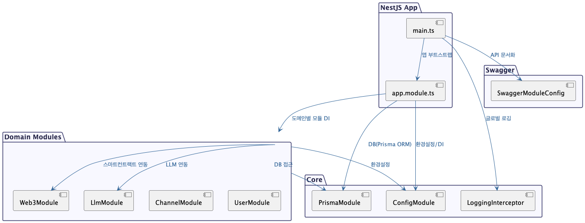
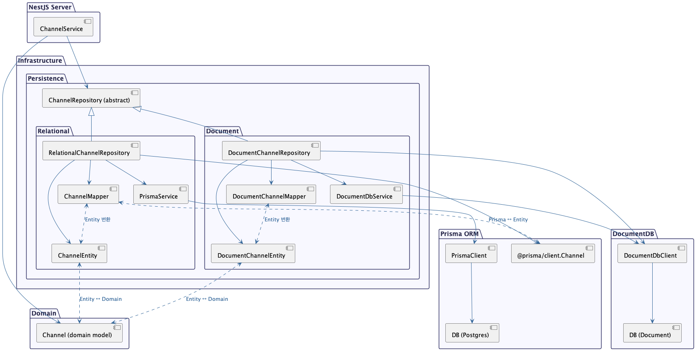
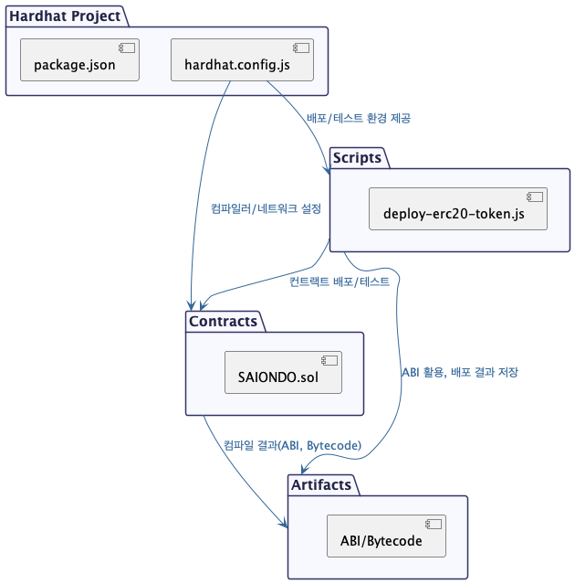
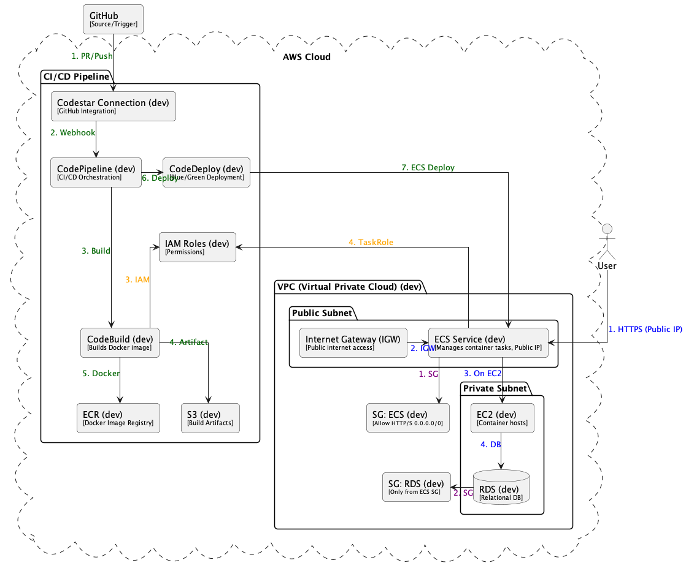
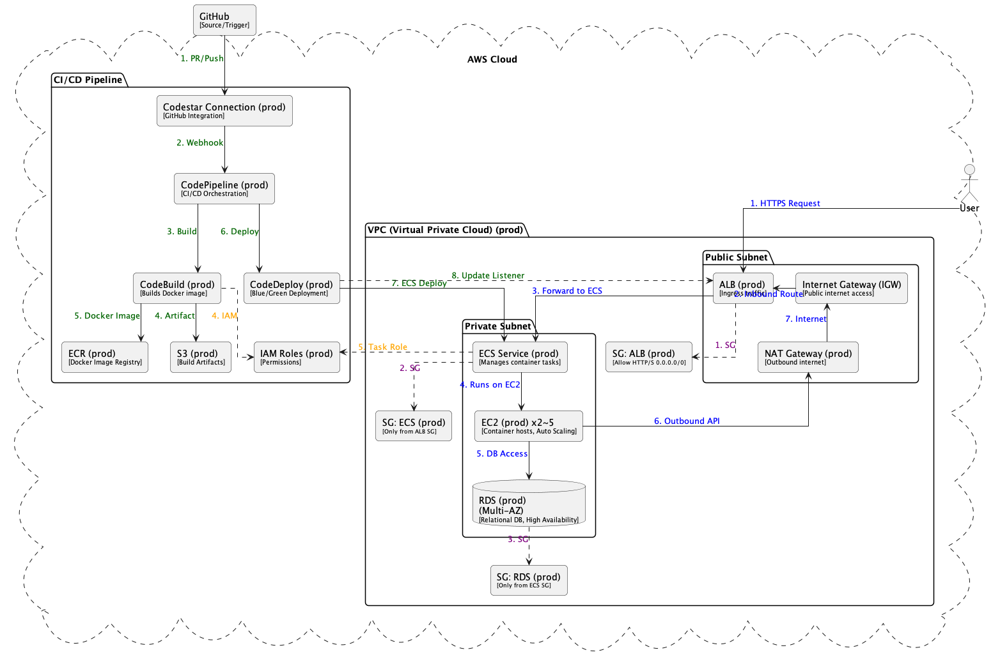
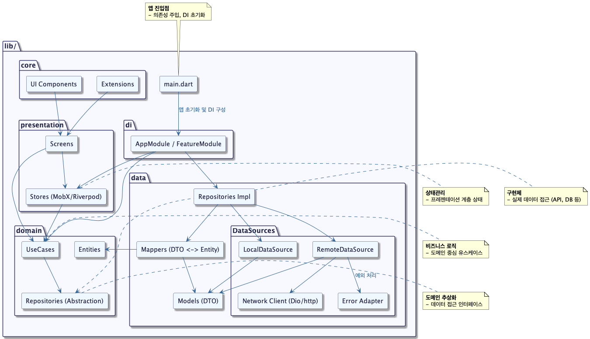
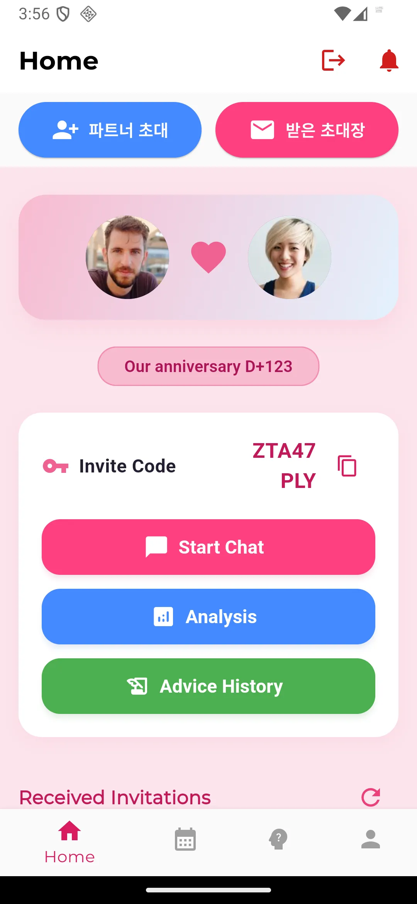
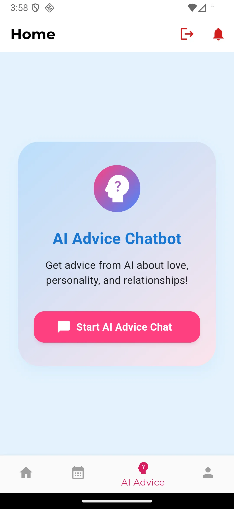

# Saiondo

**Saiondo**는 연인/커플의 대화와 성향을 분석하여 맞춤형 조언을 제공하는 AI 기반 커플 케어 서비스입니다.

---

## 🏗️ 프로젝트 구조

saiondo/
├── backend/
├── frontend/
├── infrastructure/
├── web3/
├── docs/
│ └── images/
│ ├── api/
│ │ ├── architecture.png
│ │ └── domain_infra.png
│ ├── llm/
│ │ └── architecture.png
│ ├── web3/
│ │ └── architecture.png
│ ├── infra/
│ │ ├── dev-architecture-full.png
│ │ └── prod-architecture-full.png
│ └── app/
│ ├── architecture_component.png
│ ├── 4-6-1.webp ~ 4-6-7.webp
└── README.md

---

## 🚀 주요 기능

- **AI 기반 커플 대화 분석 및 조언**
- **1:1 대화방, 성향 분석, 리포트 제공**
- **OpenAI/Claude 등 LLM 연동**
- **Flutter 기반 모바일/웹 앱**
- **REST API, 인증, 결제 등 지원**

---

## 🖼️ 시스템 아키텍처 (API)

> **설명:**  
> 위 이미지는 SAIONDO의 API 서버 아키텍처를 나타냅니다.  
> NestJS 기반의 REST API가 도메인별로 분리되어 있으며, LLM 서버와의 연동 구조도 포함되어 있습니다.

---

## 🖼️ 도메인 & 인프라 구조 (API)

> **설명:**  
> API 서버의 주요 도메인(사용자, 관계, 채팅 등)과 인프라(데이터베이스, 외부 연동 등) 구성을 시각화한 다이어그램입니다.

---

## 🖼️ LLM 서버 아키텍처

> **설명:**  
> FastAPI 기반 LLM 서버의 구조와, 다양한 LLM Provider(OpenAI, Claude 등)와의 연동 방식을 보여줍니다.

---

## 🖼️ Web3 구조

> **설명:**  
> 스마트컨트랙트, 배포, 검증 등 Web3 관련 주요 컴포넌트와 상호작용 구조를 나타냅니다.

---

## 🖼️ 인프라 전체 아키텍처

### 개발 환경

### 운영 환경

> **설명:**  
> Terraform으로 관리되는 AWS 인프라의 전체 구조(개발/운영 환경)를 시각화한 다이어그램입니다.

---

## 🖼️ 앱 주요 컴포넌트

> **설명:**  
> Flutter 기반 앱의 주요 컴포넌트 구조와 데이터 흐름을 보여줍니다.

---

## 🗃️ 데이터베이스 ERD

> **설명:**  
> 위 ERD(Entity Relationship Diagram)는 주요 데이터베이스 테이블(User, Relationship, Chat, PersonaProfile, AdviceReport 등) 간의 관계를 시각화한 것입니다.  
> 각 엔티티는 커플 관리, 대화 기록, 성향 분석, 리포트 제공 등 핵심 기능을 담당합니다.

---

## 📱 메인 화면 스크린샷

> **설명:**  
> 위 이미지는 실제 앱의 메인 화면 예시입니다.  
> - 커플 대화방, 성향 분석 리포트, 맞춤형 조언 등 주요 기능을 한눈에 볼 수 있습니다.  
> - Flutter 기반의 직관적 UI/UX를 제공합니다.

---

## 🛠️ 개발/실행

### 백엔드
- `cd backend/api && yarn install`
- `cd backend/llm && pip install -r requirements.txt`
- `cd backend && docker compose up -d`

### 프론트엔드
- `cd frontend/app`
- `fvm flutter pub get`
- `fvm flutter run -d chrome` (웹) 또는 `fvm flutter run` (모바일)

## 🗃️ 데이터베이스 ERD

- User, Relationship, Chat, PersonaProfile, AdviceReport 등 주요 엔티티로 구성
- 상세 ERD 및 시퀀스는 `puml/` 참고

## 📚 참고

- 각 디렉토리별 README 및 코드 주석 참고
- 인프라/운영/배포 관련 상세 가이드는 `infrastructure/terraform/README.md` 참고
- 문의/이슈: Github Issues 또는 팀 Slack 채널 활용
