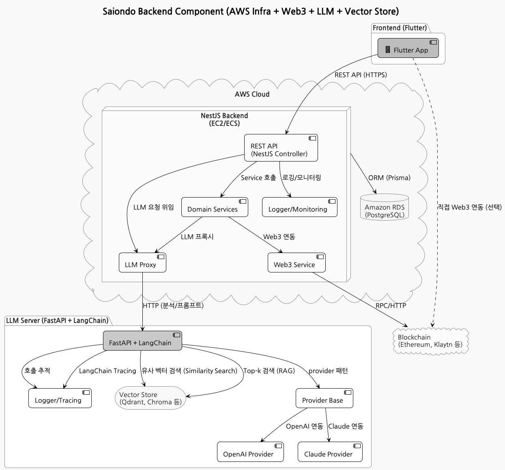
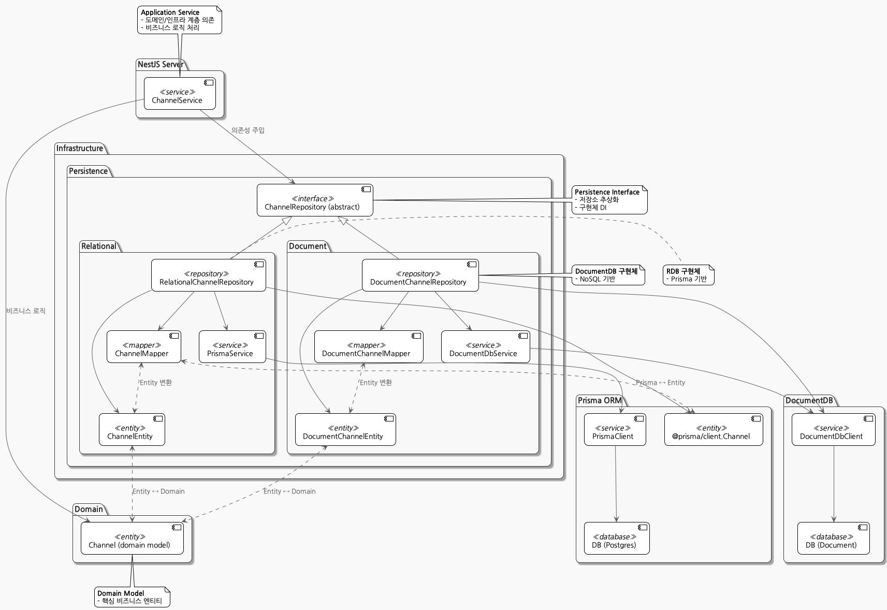
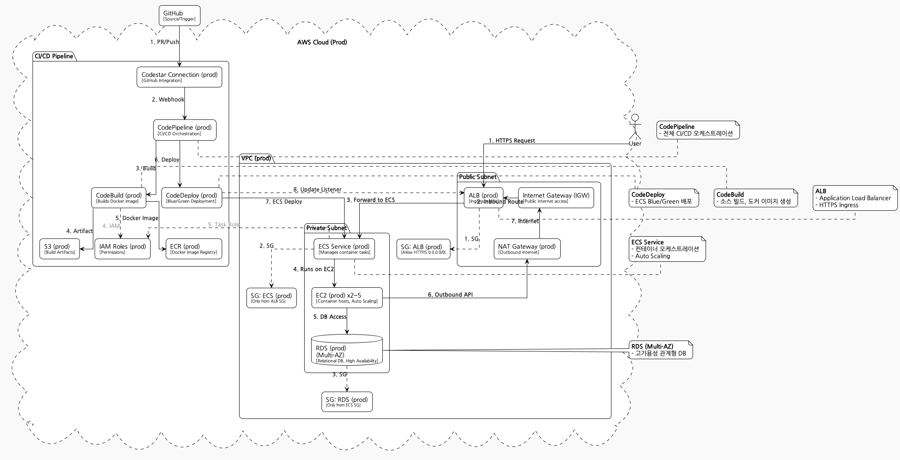
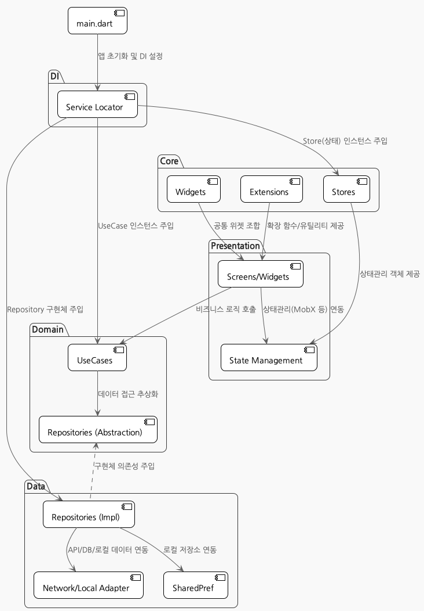

# Saiondo

> ⚠️ **이 프로젝트는 개인 프로젝트이며, 현재 진행중입니다.**
>  
> 기능, 구조, 문서 등은 개발 상황에 따라 언제든 변경될 수 있습니다.

---

**Saiondo**는 연인/커플의 대화와 성향을 분석하여 맞춤형 조언을 제공하는 AI 기반 커플 케어 서비스입니다.

---

## 🖼️ 프로젝트 전체 구조

<p align="center">
  
</p>

> **설명:**  
> SAIONDO의 전체 시스템 아키텍처.  
> 백엔드, 프론트엔드, 인프라, Web3, LLM 등 모든 주요 컴포넌트와 상호작용 구조를 한눈에 볼 수 있습니다.

---

## 🏗️ 프로젝트 디렉토리 구조

```
saiondo/
├── assets/
├── backend/
│   ├── api/
│   ├── llm/
│   ├── buildspec.yml
│   ├── deploy.sh
│   ├── docker-compose.yml
├── frontend/
│   └── app/
├── infrastructure/
│   └── terraform/
├── web3/
├── docs/
└── README.md
```

---

## 🚀 주요 기능

- AI 기반 커플 대화 분석 및 맞춤형 조언
- 1:1 대화방, 성향 분석, 리포트 제공
- OpenAI/Claude 등 LLM 연동
- Flutter 기반 모바일/웹 앱
- REST API, 인증, 결제 등 지원

---

## 🗃️ 데이터베이스 ERD

<p align="center">
  
</p>

> **설명:**  
> 주요 데이터베이스 테이블(User, Channel, Chat, PersonaProfile, Advice 등) 간의 관계를 시각화한 ERD입니다.

<details>
<summary>ERD PlantUML 예시 보기</summary>

```puml
@startuml
entity "User" as User {
  *id : String
  name : String
  email : String
  ...
}
entity "Channel" as Channel {
  *id : String
  ...
}
entity "Chat" as Chat {
  *id : String
  ...
}
User ||--o{ Chat : ""
Channel ||--o{ Chat : ""
...
@enduml
```
</details>

---

## 🖼️ 시스템 아키텍처 및 주요 컴포넌트

### API 서버 아키텍처

<p align="center">
  
</p>
> NestJS 기반 REST API의 도메인 분리 및 LLM 연동 구조

---

### 도메인 & 인프라 구조

<p align="center">
  
</p>
> API 서버의 주요 도메인(사용자, 관계, 채팅 등)과 인프라(데이터베이스, 외부 연동 등) 구성

---

### LLM 서버 아키텍처

<p align="center">
  
</p>
> FastAPI 기반 LLM 서버와 다양한 LLM Provider(OpenAI, Claude 등) 연동 구조

---

### Web3 구조

<p align="center">
  
</p>
> 스마트컨트랙트, 배포, 검증 등 Web3 관련 주요 컴포넌트와 상호작용 구조

---

### 인프라 전체 아키텍처

**개발 환경**
<p align="center">
  
</p>

**운영 환경**
<p align="center">
  
</p>
> Terraform으로 관리되는 AWS 인프라의 전체 구조(개발/운영 환경)

---

### 앱 주요 컴포넌트

<p align="center">
  
</p>
> Flutter 기반 앱의 주요 컴포넌트 구조와 데이터 흐름

---

## 📱 메인 화면 스크린샷

<p align="center">
  
  
  
  
  
  
  
</p>

<p align="center">
  <b>SAIONDO 앱의 주요 화면 스크린샷</b><br>
  커플 대화방, 성향 분석, 리포트 등 다양한 기능을 한눈에 볼 수 있습니다.
</p>

---

## 🛠️ 개발/실행

### 백엔드
```sh
cd backend/api && yarn install
cd backend/llm && pip install -r requirements.txt
cd backend && docker compose up -d
```

### 프론트엔드
```sh
cd frontend/app
fvm flutter pub get
fvm flutter run -d chrome   # 웹 실행
fvm flutter run             # 모바일 실행
```

---

## 📄 하위 모듈별 문서/가이드

### Backend
- [backend/llm/README.md](./backend/llm/README.md)
- [backend/llm/docs/README-SMITH.md](./backend/llm/docs/langsmith-guide.md)
- [backend/api/README.md](./backend/api/README.md)
- [backend/api/README-MESSAGES.md](backend/api/docs/fcm-message-guide.md)
- [backend/api/README-POSTGRES.md](backend/api/docs/postgres-guide.md)

### Frontend
- [frontend/app/README.md](./frontend/app/README.md)
- [frontend/app/docs/ios-build-run.md](./frontend/app/docs/ios-build-run.md)
- [frontend/app/docs/aos-build-run.md](./frontend/app/docs/aos-build-run.md)

### Infrastructure
- [infrastructure/README.md](./infrastructure/README.md)
- [infrastructure/terraform/README.md](./infrastructure/terraform/README.md)

### Web3
- [web3/README.md](./web3/README.md)

### Docs
- [docs/readme_web3.md](./docs/readme_web3.md)
- [docs/readme_business.md](./docs/readme_business.md)
- [docs/readme_dev.md](./docs/readme_dev.md)

---

## 📚 참고 및 문서 작성 제안

- 각 모듈별 상세한 사용법, 개발/배포 가이드 등은 위의 README 및 문서 파일을 참고하세요.
- 추가 문서가 필요하면 각 디렉토리의 `docs/` 폴더를 확인하세요.

### 📌 **추가로 있으면 좋은 문서**
1. **CONTRIBUTING.md**  
   - 오픈소스 협업을 염두에 둔다면, 기여 방법/PR 규칙/코딩 컨벤션 등 안내
2. **CHANGELOG.md**  
   - 주요 릴리즈/변경 이력 관리
3. **docs/architecture.md**  
   - 아키텍처 상세 설명, 의사결정 근거, 기술스택 선정 이유 등
4. **docs/faq.md**  
   - 자주 묻는 질문 및 문제 해결법
5. **docs/security.md**  
   - 인증/보안 정책, 개인정보 처리방침 등
6. **docs/deployment.md**  
   - 실제 배포/운영 환경 세팅, CI/CD, 인프라 관리 가이드

---
