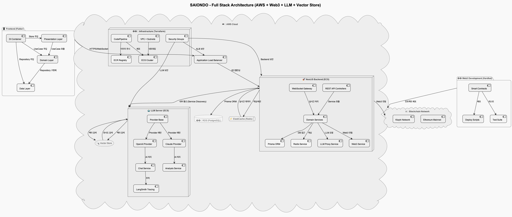
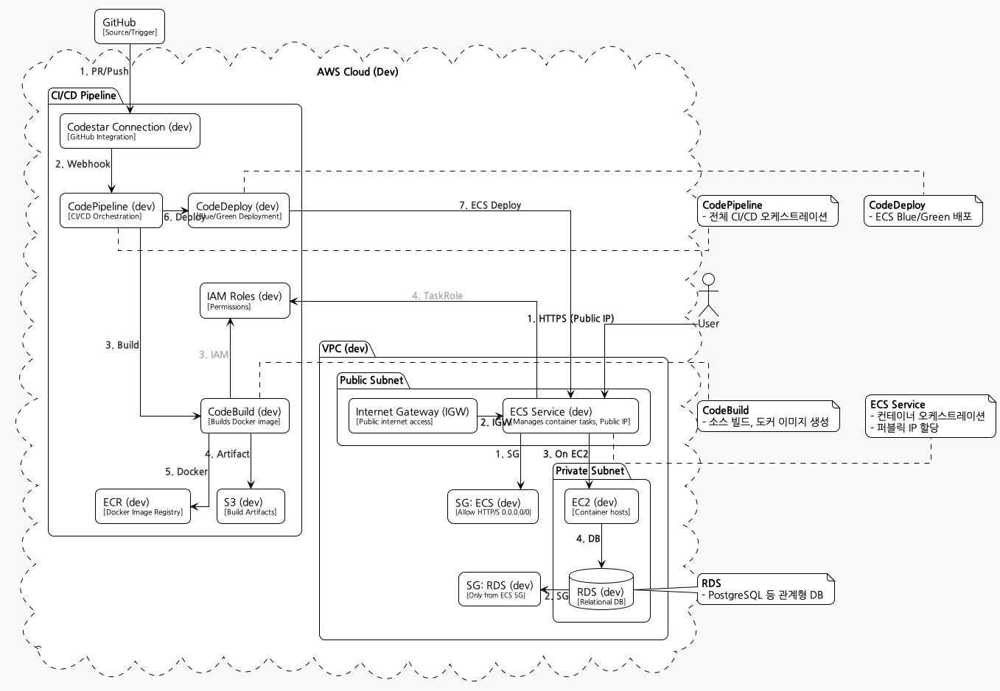
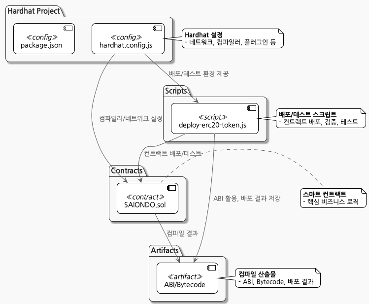

# 🌱 Saiondo

> ⚠️ **이 프로젝트는 개인 프로젝트이며, 현재 진행중입니다.**
>
> 기능, 구조, 문서 등은 개발 상황에 따라 언제든 변경될 수 있습니다.

---

**Saiondo**는 연인/커플의 대화와 성향을 분석하여 맞춤형 조언을 제공하는  
**AI 기반 커플 케어 서비스**입니다.

---

## 🖼️ 시스템 아키텍처 전체 구조

<p align="center">
  
</p>

> **설명:** SAIONDO의 전체 시스템 아키텍처.  
> 백엔드, 프론트엔드, 인프라, Web3, LLM 등 모든 주요 컴포넌트와 상호작용 구조를 한눈에 볼 수 있습니다.

---

## 🏗️ 프로젝트 디렉토리 구조

```plaintext
saiondo/
├── assets/
├── backend/
│   ├── api/
│   ├── llm/
│   ├── buildspec.yml
│   ├── deploy.sh
│   ├── docker-compose.yml
├── frontend/
│   └── app/
├── infrastructure/
│   └── terraform/
├── web3/
├── docs/
└── README.md
```

---

## 🚀 주요 기능

- <kbd>AI 기반 커플 대화 분석 및 맞춤형 조언</kbd>
- <kbd>1:1 대화방, 성향 분석, 리포트 제공</kbd>
- <kbd>OpenAI/Claude 등 LLM 연동</kbd>
- <kbd>Flutter 기반 모바일/웹 앱</kbd>
- <kbd>REST API, 인증, 결제 등 지원</kbd>

---

## 🗃️ 데이터베이스 ERD

<p align="center">
  
</p>

> **설명:** 주요 데이터베이스 테이블(User, Channel, Chat, PersonaProfile, Advice 등) 간의 관계를 시각화한 ERD입니다.

<details>
<summary><b>ERD PlantUML 예시 보기</b></summary>

```puml
@startuml
entity "User" as User {
  *id : String
  name : String
  email : String
  ...
}
entity "Channel" as Channel {
  *id : String
  ...
}
entity "Chat" as Chat {
  *id : String
  ...
}
User ||--o{ Chat : ""
Channel ||--o{ Chat : ""
...
@enduml
```
</details>

---

## 🖼️ 시스템 아키텍처 및 주요 컴포넌트

### 🛠️ Backend

<p align="center">
  
</p>

> **설명:** NestJS 기반 REST API 서버와 Prisma ORM을 사용한 데이터베이스 관리.  
> 사용자 인증, 채팅 관리, 결제 처리, FCM 푸시 알림 등 핵심 비즈니스 로직을 처리합니다.

- <kbd><a href="./backend/api/README.md">API 서버 (NestJS/Prisma)</a></kbd>
  &nbsp;
  <kbd><a href="./backend/api/docs/postgres-guide.md">PostgreSQL 명령어 가이드</a></kbd>
  &nbsp;
  <kbd><a href="./backend/api/docs/fcm-message-guide.md">FCM 메시지 연동 가이드</a></kbd>
- <kbd><a href="./backend/llm/README.md">LLM 서버 (FastAPI/LangChain)</a></kbd>
  &nbsp;
  <kbd><a href="./backend/llm/docs/langsmith-guide.md">LangSmith 활용 가이드</a></kbd>

---

### 💻 Frontend

<p align="center">
  
</p>

> **설명:** Flutter 기반 크로스 플랫폼 앱으로 iOS, Android, Web을 지원.  
> Riverpod 상태관리, 커스텀 위젯, 실시간 채팅, 성향 분석 리포트 등 사용자 인터페이스를 제공합니다.

- <kbd><a href="./frontend/app/README.md">Flutter 앱</a></kbd>
  &nbsp;
  <kbd><a href="./frontend/app/docs/ios-build-run.md">iOS 빌드/배포 가이드</a></kbd>
  &nbsp;
  <kbd><a href="./frontend/app/docs/aos-build-run.md">Android 빌드/배포 가이드</a></kbd>

---

### ☁️ Infrastructure

**개발 환경**
<p align="center">
  
</p>

> **설명:** 개발 환경용 AWS 인프라 구성.  
> ECS Fargate, RDS, ElastiCache, S3, CloudFront 등을 사용하여 확장 가능한 개발 환경을 구축합니다.

**운영 환경**
<p align="center">
  
</p>

> **설명:** 운영 환경용 고가용성 AWS 인프라 구성.  
> Auto Scaling, Load Balancer, Multi-AZ 배포, CloudWatch 모니터링 등으로 안정적인 서비스를 제공합니다.

- <kbd><a href="./infrastructure/README.md">Terraform 인프라 가이드</a></kbd>
  &nbsp;
  <kbd><a href="./infrastructure/terraform/README.md">Terraform 환경별 상세 가이드</a></kbd>

---

### 🔗 Web3

<p align="center">
  
</p>

> **설명:** 블록체인 기반 커플 토큰 및 NFT 시스템.  
> Solidity 스마트 컨트랙트, IPFS 메타데이터 저장, 커플 전용 토큰 발행 및 거래 기능을 제공 합니다.

- <kbd><a href="./web3/README.md">Web3 빌드/배포/검증 가이드</a></kbd>

---

### 📚 Docs

- <kbd><a href="./docs/readme_web3.md">Web3 설계/운영 참고</a></kbd>
  &nbsp;
  <kbd><a href="./docs/readme_business.md">비즈니스/기획 참고</a></kbd>
  &nbsp;
  <kbd><a href="./docs/readme_dev.md">개발 환경/팁</a></kbd>

---

## 📱 메인 화면 스크린샷

<p align="center">
  
  
  
  
  
  
  
</p>

<p align="center">
  <b>SAIONDO 앱의 주요 화면 스크린샷</b><br>
  커플 대화방, 성향 분석, 리포트 등 다양한 기능을 한눈에 볼 수 있습니다.
</p>

---

## 📚 참고 및 문서 작성 제안

- 각 모듈별 상세한 사용법, 개발/배포 가이드 등은 위의 README 및 문서 파일을 참고하세요.
- 추가 문서가 필요하면 각 디렉토리의 <kbd>docs/</kbd> 폴더를 확인하세요.

---

> 문의/기여/개선 제안은 <kbd>Issues</kbd> 또는 각 모듈별 README의 안내를 참고하세요!
