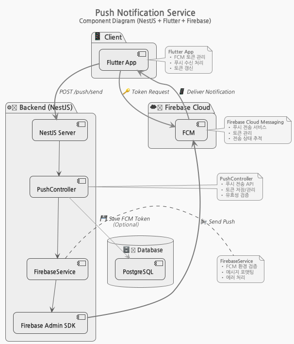
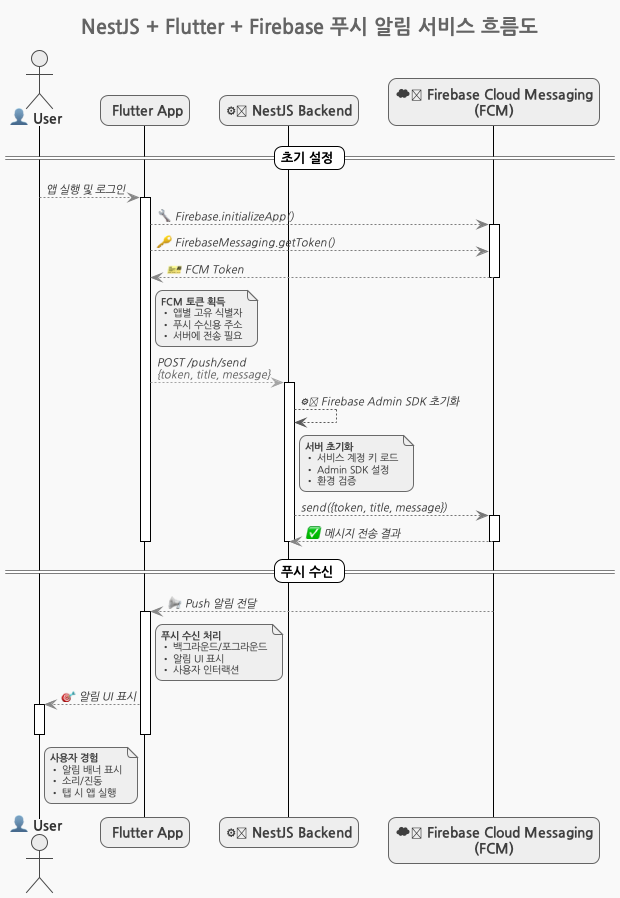

# 📲 Saiondo API - FCM(푸시) 메시지 연동 가이드

Saiondo API는 **Firebase Cloud Messaging(FCM)**을 이용해 모바일 클라이언트에 푸시 알림을 전송합니다.  
이 문서는 실제 프로젝트 구조와 코드를 기반으로 FCM 연동 방식, 데이터 흐름, API 사용법, 실전 팁을 정리한 가이드입니다.

---

## 📋 목차
- [1. 전체 연동 구조](#1-전체-연동-구조)
- [2. 주요 컴포넌트 및 역할](#2-주요-컴포넌트-및-역할)
- [3. 데이터 흐름](#3-데이터-흐름)
- [4. API 사용법](#4-api-사용법)
- [5. 실전 예시/코드](#5-실전-예시코드)
- [6. Best Practices & 운영 팁](#6-best-practices--운영-팁)
- [7. FAQ & 문제 해결](#7-faq--문제-해결)
- [8. 참고 자료](#8-참고-자료)

---

## 1. 전체 연동 구조

### 🔧 컴포넌트 다이어그램

<p align="center">
  
</p>

**핵심 특징:**
- ✅ **Firebase Admin SDK**로 서버에서 직접 FCM 메시지 전송
- ✅ 유저별 FCM 토큰을 DB(User 테이블)에 저장/관리
- ✅ 푸시 발송 로직은 `PushService`에서 담당
- ✅ API는 `PushController`에서 제공
- ✅ 역할별로 서비스/컨트롤러/DTO가 명확히 분리

---

## 2. 주요 컴포넌트 및 역할

### 2.1 📤 FirebaseService
**위치:** `src/common/firebase/firebase.service.ts`

- **역할:** Firebase Admin SDK 초기화 및 메시징 객체 제공
- **보안:** 서비스 계정 키는 `.gitignore`에 추가, 환경변수/CI로 관리

```typescript
@Injectable()
export class FirebaseService implements OnModuleInit {
  onModuleInit() {
    if (admin.apps.length === 0) {
      admin.initializeApp({
        credential: admin.credential.cert(serviceAccount as admin.ServiceAccount),
      });
    }
  }
  get messaging() {
    return admin.messaging();
  }
}
```

### 2.2 📤 PushService
**위치:** `src/modules/push-schedule/push.service.ts`

- **역할:** 실제 FCM 메시지 전송, 토큰 관리, 유저별/직접 푸시 발송
- **주요 메서드:**
  - `sendFcmMessage(token, title, body, data?)`
  - `getUserFcmToken(userId)`
  - `sendPushToUser(userId, title, body, data?)`
  - `sendPush(token, title, body, data?)`

```typescript
async sendPushToUser(userId: string, title: string, body: string, data?: Record<string, string>) {
  const fcmToken = await this.getUserFcmToken(userId);
  return await this.sendFcmMessage(fcmToken, title, body, data);
}
```

### 2.3 📤 PushController
**위치:** `src/modules/push-schedule/push.controller.ts`

- **API 엔드포인트:**
  - `POST /push/send` - 토큰 직접 지정하여 푸시 발송
  - `POST /push/send/user/:userId/message` - 유저ID로 푸시 발송

```typescript
@Post('send/user/:userId/message')
async sendPushToUser(@Param('userId') userId: string, @Body() dto: SendPushToUserDto) {
  return this.pushService.sendPushToUser(userId, dto.title, dto.body, dto.data);
}
```

---

## 3. 데이터 흐름

### 🔄 시퀀스 다이어그램

<p align="center">
  
</p>

### 단계별 설명

1. **🔑 토큰 발급**: 클라이언트가 FCM 토큰을 발급받음
2. **토큰 저장**: `/users/:id/fcm-token`으로 서버에 저장
3. **푸시 요청**: 서버에 푸시 발송 요청
4. **토큰 조회**: 유저ID로 FCM 토큰 조회
5. **☁️ FCM 전송**: FirebaseService가 FCM 메시지 전송
6. **알림 수신**: 클라이언트에서 푸시 알림 수신

---

## 4. API 사용법

### 4.1 유저별 푸시 발송

```http
POST /api/push/send/user/{userId}/message
Content-Type: application/json

{
  "title": "새로운 메시지",
  "body": "새로운 메시지가 도착했습니다.",
  "data": {
    "channelId": "123",
    "messageId": "456"
  }
}
```

### 4.2 🔑 FCM 토큰 업데이트

```http
PATCH /api/users/{userId}/fcm-token
Content-Type: application/json

{
  "fcmToken": "fcm_token_string_here"
}
```

### 4.3 직접 토큰으로 푸시 발송

```http
POST /api/push/send
Content-Type: application/json

{
  "token": "fcm_token_string",
  "title": "테스트 알림",
  "body": "이것은 테스트 메시지입니다.",
  "data": {
    "type": "test"
  }
}
```

---

## 5. 실전 예시/코드

### 5.1 🚀 기본 사용 시나리오

```typescript
// 1. 유저 로그인 시 FCM 토큰 저장
await updateFcmToken(userId, fcmToken);

// 2. 특정 이벤트 발생 시 푸시 발송
await pushService.sendPushToUser(userId, "새 메시지", "새로운 메시지가 도착했습니다.");

// 3. 커플 알림 (채널 멤버들에게)
for (const member of channel.members) {
  await pushService.sendPushToUser(member.userId, "커플 알림", "새로운 커플 이벤트가 있습니다.");
}
```

### 5.2 에러 처리 예시

```typescript
try {
  await pushService.sendPushToUser(userId, title, body);
} catch (error) {
  if (error.message.includes('FCM 환경 이상')) {
    // FCM 환경 문제 - DB에는 저장, 푸시는 스킵
    console.log('FCM 환경 문제로 푸시 전송 실패');
  } else {
    // 기타 에러 처리
    console.error('푸시 전송 실패:', error);
  }
}
```

---

## 6. Best Practices & 운영 팁

### 🎨 보안
- ❌ **절대 GitHub에 서비스 계정 키 업로드 금지**
- ✅ **환경변수/CI로 키 파일 경로 관리**
- ✅ **서비스 계정 키는 정기적으로 갱신**

### 🚀 성능/운영
- ✅ **토큰 캐싱**: 자주 사용하는 토큰은 Redis에 캐시
- ✅ **배치 처리**: 대량 푸시는 배치로 처리
- ✅ **에러 재시도**: 일시적 실패 시 재시도 로직 구현
- ✅ **푸시 전송 성공률/실패율 모니터링**
- ✅ **토큰 만료/갱신 로그 관리**
- ✅ **FCM 환경 상태 체크 및 알림**

### 🔧 테스트
- ✅ **개발 환경**: 실제 푸시 대신 로그/모킹 처리
- ✅ **테스트 토큰**: 개발용 FCM 토큰 별도 관리
- ✅ **통합 테스트**: 전체 푸시 플로우 테스트

---

## 7. FAQ & 문제 해결

### 자주 발생하는 문제

1. **"Invalid JWT Signature" 에러**
   - 서버 시간 동기화 필요
   - 서비스 계정 키 재발급 필요

2. **토큰 만료**
   - 클라이언트에서 토큰 갱신 후 서버 업데이트

3. **FCM 환경 문제**
   - `validateFcmEnvironment()` 메서드로 사전 체크

4. **빌드/배포 시 서비스 계정 키 누락**
   - `.gitignore`에 의해 키 파일이 누락될 수 있음
   - CI/CD에서 환경변수 또는 시크릿으로 주입

---

## 8. 참고 자료

- [Firebase Cloud Messaging 공식 문서](https://firebase.google.com/docs/cloud-messaging)
- [Firebase Admin SDK 문서](https://firebase.google.com/docs/admin/setup)
- [NestJS 공식 문서](https://docs.nestjs.com/)

---
