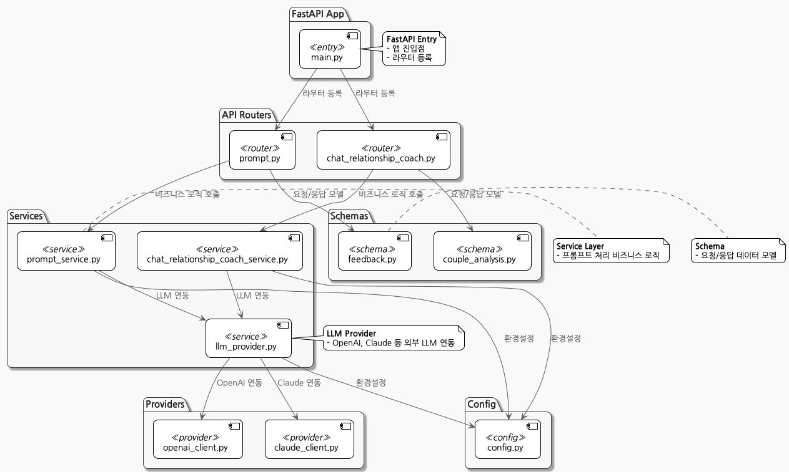

# 🤖 SAIONDO LLM Server

**FastAPI(Python) 기반의 LLM(대형 언어 모델) 연동 서버**  
SAIONDO의 LLM 서버는 OpenAI, Claude 등 다양한 LLM Provider와 연동하여  
커플 대화 분석, AI 챗봇, 성향 분석, 피드백 수집 등 핵심 AI 기능을 제공합니다.

---

<p align="center">
  
</p>

---

## 📁 프로젝트 폴더 구조

```
llm/
├── src/
│ ├── main.py # FastAPI 앱 진입점
│ ├── config.py # 환경설정/DI
│ ├── api/ # 엔드포인트(라우터) 모듈
│ ├── services/ # 비즈니스 로직(서비스) 모듈
│ ├── schemas/ # Pydantic 데이터 모델
│ ├── providers/ # LLM Provider 구현
│ ├── core/ # 핵심 유틸리티
│ ├── graph/ # LangGraph 워크플로우
│ ├── mcp/ # Model Context Protocol
│ └── tests/ # 테스트 코드
│ ├── test_enhanced_couple_analysis.py
│ └── labeling/
├── docs/ # 문서
│ └── langsmith-guide.md # LangSmith 가이드
├── puml/ # PlantUML 다이어그램
├── requirements.txt # Python 의존성
├── Dockerfile # Docker 이미지
├── Dockerfile.dev # 개발용 Docker 이미지
├── run_server.sh # 서버 실행 스크립트
├── .env.example # 환경변수 예시
└── README.md # 프로젝트 문서
```

## 🏗️ 아키텍처 및 개발 패턴

### **계층 구조**

```
┌─────────────────────────────────────┐
│           API Layer                 │
│  (FastAPI Routers)                 │
├─────────────────────────────────────┤
│         Service Layer              │
│  (Business Logic)                  │
├─────────────────────────────────────┤
│        Provider Layer              │
│  (LLM Integration)                 │
├─────────────────────────────────────┤
│         Core Layer                 │
│  (Utilities & Helpers)             │
└─────────────────────────────────────┘
```

## 🧩 주요 도메인 및 API

- **/chat**: 프롬프트 기반 LLM 응답 API (OpenAI, Claude 등 선택)
- **/analyze**: 사용자/파트너 프롬프트, 메타데이터 기반 관계 분석
- **/feedback**: 사용자 피드백 수집/저장
- **/health**: 헬스체크
- **/providers/**: LLM API 연동(OpenAI, Claude 등)
- **/graph/**: 관계 분석 그래프, 노드 등
- **/mcp/**: 대화 context 등 도메인별 유틸리티

> **API 상세 문서:** [Swagger UI (localhost:8000/docs)](http://localhost:8000/docs)  
> **ReDoc:** [localhost:8000/redoc](http://localhost:8000/redoc)

## ⚙️ 주요 기술 스택

- **Python 3.11+**
- **FastAPI**: 웹 프레임워크
- **Uvicorn**: ASGI 서버
- **Pydantic**: 데이터 모델/검증
- **langchain, langgraph**: LLM 워크플로우/그래프
- **openai, requests**: 외부 LLM API 연동
- **python-dotenv**: 환경변수 관리
- **langsmith**: LLM 트레이싱/실험/평가 (옵션)

> 주요 의존성은 [`requirements.txt`](./requirements.txt) 참고

## 🚀 빠른 시작 (로컬 개발 환경)

### 1. 가상환경 생성 및 의존성 설치

```sh
cd backend/llm
python3 -m venv venv
source venv/bin/activate
pip install -r requirements.txt
```

### 2. 환경변수(.env) 설정

- `.env.example` 파일을 참고하여 `.env` 파일을 생성하고, 필요한 API Key 및 환경변수를 입력하세요.
  ```sh
  cp .env.example .env
  # .env 파일을 열어 OPENAI_API_KEY 등 값 입력
  ```

### 3. 개발 서버 실행

```sh
PYTHONPATH=src uvicorn src.main:app --reload --host 0.0.0.0 --port 8000
```
- 서버가 정상적으로 실행되면, [http://localhost:8000/docs](http://localhost:8000/docs)에서 Swagger UI로 API를 테스트할 수 있습니다.

## �� Docker로 실행

### 1. Docker 이미지 빌드

```sh
docker build -t saiondo-llm .
```

### 2. 컨테이너 실행

```sh
docker run --env-file .env -p 8000:8000 saiondo-llm
```

## 🧪 테스트

- **pytest** 기반 테스트 실행
  ```sh
  pytest src/tests/
  ```
- 테스트 커버리지, 구조 등은 `src/tests/` 참고

## 📊 모니터링 및 트레이싱

- **LangSmith** 연동으로 LLM 체인 트레이싱/디버깅/평가 지원  
  → [LangSmith 가이드](./docs/langsmith-guide.md) 참고

- **구조화 로깅**: `structlog` 등 활용

## 📝 주요 문서

- [LangSmith 활용 가이드](./docs/langsmith-guide.md)
- [PostgreSQL 실무 가이드](../api/docs/postgres-guide.md)
- [API 문서 (Swagger)](http://localhost:8000/docs)

## ��️ 개발/운영 가이드

### 새로운 API 엔드포인트 추가

1. **스키마 정의** (`src/schemas/`)
2. **서비스 로직** (`src/services/`)
3. **API 엔드포인트** (`src/api/`)
4. **메인 앱에 등록** (`src/main.py`)

### 새로운 LLM Provider 추가

1. **Provider 클라이언트** (`src/providers/`)
2. **LLM Provider에 등록** (`src/services/llm_provider.py`)

### LangGraph 워크플로우 추가

1. **노드 정의** (`src/graph/nodes.py`)
2. **그래프 구성** (`src/graph/`)

## 🤝 문제 해결

| 문제                | 해결 방법                                      |
|---------------------|-----------------------------------------------|
| 환경변수 누락       | `.env` 파일에 필수 API 키 확인                |
| 포트 충돌           | 다른 포트 사용: `--port 8001`                 |
| LLM API 오류        | API 키 유효성 및 할당량 확인                  |
| 패키지 설치 오류    | Python 버전 확인 (3.11+)                      |
| Redis 연결 오류     | Redis 서버 실행 또는 캐싱 비활성화            |

### 디버깅

```bash
uvicorn src.main:app --reload --log-level debug
```

## 🚀 배포

### Production 환경

```bash
uvicorn src.main:app --host 0.0.0.0 --port 8000 --workers 4
# 또는 Gunicorn 사용 (권장)
gunicorn src.main:app -w 4 -k uvicorn.workers.UvicornWorker --bind 0.0.0.0:8000
```

### Docker Production

```dockerfile
FROM python:3.11-slim
WORKDIR /app
COPY requirements.txt .
RUN pip install -r requirements.txt
COPY src/ ./src/
EXPOSE 8000
CMD ["uvicorn", "src.main:app", "--host", "0.0.0.0", "--port", "8000"]
```
