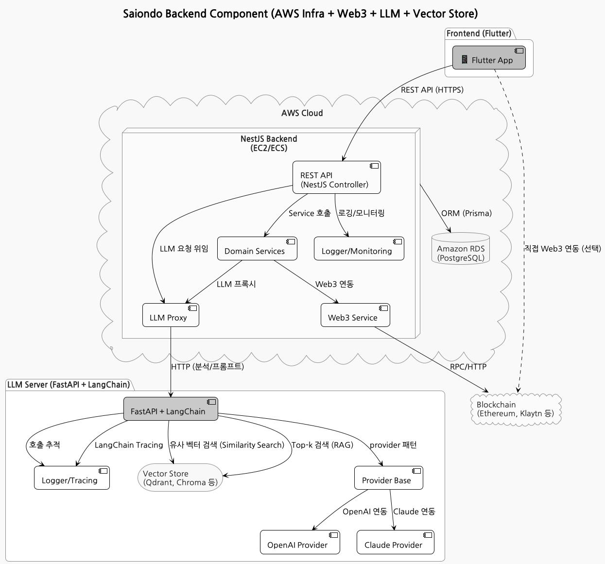

# 🏛️ Saiondo Architecture Guide

> **이 문서는 Saiondo 프로젝트의 전체 시스템 아키텍처, 주요 설계 의도, 기술스택 선정 이유,  
> 각 계층별 구조와 상호작용, 운영/확장 전략을 상세히 설명합니다.**

---

## 1. 전체 시스템 아키텍처

  

- **설명:**  
  - Saiondo는 백엔드(API/LLM), 프론트엔드(Flutter), 인프라(Terraform), Web3(스마트컨트랙트) 등  
    다양한 모듈이 유기적으로 연동되는 **모던 멀티스택 서비스**입니다.
  - 모든 컴포넌트는 **API-first, 모듈화, 자동화, 확장성**을 최우선으로 설계되었습니다.

---

## 2. 계층별 아키텍처 및 설계 의도

### 2.1. Backend (API/LLM)

- **API 서버**
  - **NestJS(Typescript) + Prisma + PostgreSQL**
  - 도메인별 모듈 구조, CQRS/Event 기반 확장성
  - 인증/인가, 대화/분석/리포트, FCM 푸시 등 커플 케어 핵심 로직 담당
  - [API 서버 상세](../backend/api/README.md)
- **LLM 서버**
  - **FastAPI(Python) + LangChain + OpenAI/Claude**
  - 프롬프트 기반 대화, 성향 분석, 리포트 생성 등 AI 기능 담당
  - LangSmith 연동으로 실시간 트레이싱/디버깅/평가 지원
  - [LLM 서버 상세](../backend/llm/README.md)

#### 설계 의도
- **도메인 분리**: 유지보수/확장성/테스트 용이
- **API-first**: 프론트/외부 연동 유연성
- **AI/LLM 분리**: 언어모델 실험/운영 독립성

---

### 2.2. Frontend

- **Flutter 3.x 기반 멀티플랫폼 앱**
  - Clean Architecture + MVVM 패턴
  - Web/Mobile/Desktop 대응, 상태관리(MobX/Provider), DI(get_it)
  - REST API, WebSocket, FCM 등 다양한 백엔드 연동
  - [Flutter 앱 구조](../frontend/app/README.md)

#### 설계 의도
- **단일 코드베이스로 멀티플랫폼 대응**
- **비즈니스/프레젠테이션/데이터 계층 분리**
- **테스트/확장/유지보수 용이성**

---

### 2.3. Infrastructure

- **AWS 기반 IaC (Terraform)**
  - VPC, RDS, EC2, ECS, ALB, S3, IAM 등 모든 리소스 코드화
  - 환경별(dev/prod) 분리, 모듈화, DRY 설계
  - CI/CD: GitHub Actions, CodePipeline, CodeBuild, ECR/ECS 자동화
  - [Terraform 인프라 가이드](../infrastructure/README.md)

#### 설계 의도
- **재현성/자동화/버전관리**
- **환경별 분리/확장성**
- **보안/비용/운영 최적화**

---

### 2.4. Web3

- **Hardhat 기반 스마트컨트랙트 개발/배포/검증**
  - Solidity, Ethers.js, TypeChain, Etherscan 연동
  - 배포/테스트/검증 자동화, 환경변수/시크릿 분리
  - [Web3 가이드](../web3/README.md)

#### 설계 의도
- **온체인/오프체인 연동 실험**
- **스마트컨트랙트 배포/검증 자동화**
- **보안/투명성/확장성**

---

## 3. 기술스택 선정 이유

| 계층         | 주요 스택                | 선정 이유/비고                                      |
|--------------|-------------------------|-----------------------------------------------------|
| Backend      | NestJS, Prisma, PostgreSQL | 타입 안전성, 모듈화, 생산성, 대규모 데이터 적합      |
| LLM          | FastAPI, LangChain, OpenAI/Claude | AI 실험/운영 분리, Python 생태계, 확장성           |
| Frontend     | Flutter, MobX, Provider  | 멀티플랫폼, 빠른 UI, 커뮤니티, 테스트 용이           |
| Infra        | Terraform, AWS           | IaC, 자동화, 확장성, 비용/보안 관리                  |
| Web3         | Hardhat, Solidity, Ethers.js | 표준 스마트컨트랙트 개발/배포/검증, 자동화         |
| DevOps       | GitHub Actions, CodePipeline, Docker | CI/CD, 컨테이너, 자동화, 협업                       |

---

## 4. 주요 의사결정 근거

- **API/LLM 분리**: AI 실험/운영 독립성, 장애 격리, 확장성
- **모듈화/계층화**: 각 도메인/기능별 독립적 개발/배포/운영
- **IaC/자동화**: 인프라/배포/운영의 재현성, 협업, 비용/보안 최적화
- **멀티플랫폼**: Flutter로 웹/모바일/데스크탑 동시 대응
- **Web3 실험**: 온체인/오프체인 융합 서비스 실험 및 확장성 확보

---

## 5. 운영/확장 전략

- **Zero-downtime 배포**: ECS rolling update, ALB health check
- **모니터링/로깅**: CloudWatch, Sentry, Datadog 등 연동
- **비용/보안 관리**: 태그, IAM 최소 권한, Secrets Manager, 자동화
- **테스트/실험/롤백**: CI/CD, 자동화 테스트, 스테이징/프리프로덕션 환경 활용
- **문서화/가이드**: 각 계층별 README, docs/architecture.md, deployment.md 등

---

## 6. 참고 이미지/문서

- <kbd><a href="../README.md">프로젝트 최상위 구조/개요</a></kbd>
- <kbd><a href="../infrastructure/README.md">인프라 상세</a></kbd>
- <kbd><a href="../docs/deployment.md">배포/운영 가이드</a></kbd>
- <kbd><a href="../backend/api/README.md">API 서버</a></kbd>
- <kbd><a href="../backend/llm/README.md">LLM 서버</a></kbd>
- <kbd><a href="../frontend/app/README.md">Flutter 앱</a></kbd>
- <kbd><a href="../web3/README.md">Web3</a></kbd>

---

> **이 문서는 Saiondo 프로젝트의 실전 아키텍처/운영/확장 경험을 반영한 예시입니다.  
> 실제 환경/팀 상황에 맞게 구조, 스택, 운영 전략을 조정하세요.**
