# 🧠 SAIONDO 유저 성향 파악 시스템 가이드

SAIONDO 프로젝트에서 **유저의 성향을 파악하기 위한 모든 기능**과  
각 분석 항목별 **시스템 아키텍처/시퀀스**를 정리한 문서입니다.  
AI 기반 분석, MBTI, 소통 스타일, 사랑의 언어 등 다양한 관점에서 유저의 성향을 종합적으로 분석하여  
개인화된 커플 케어 서비스를 제공하는 시스템을 설명합니다.

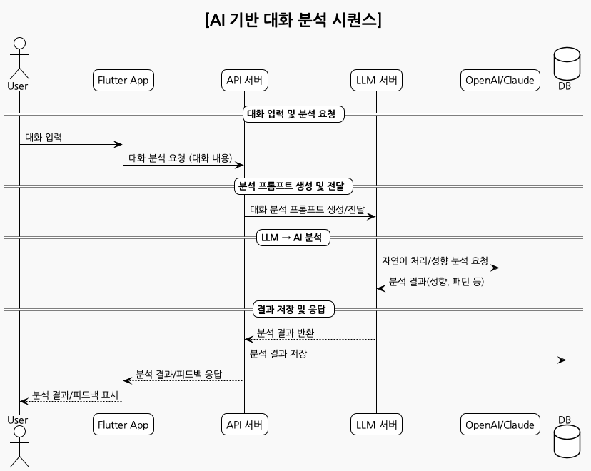

---

## 📖 목차

- [1. AI 기반 대화 분석](#1-ai-기반-대화-분석)
- [2. MBTI 성향 분석](#2-mbti-성향-분석)
- [3. 소통 스타일 분석](#3-소통-스타일-분석)
- [4. 사랑의 언어 분석](#4-사랑의-언어-분석)
- [5. 성향 프로필 시스템](#5-성향-프로필-시스템)
- [6. 관계 분석 리포트](#6-관계-분석-리포트)
- [7. AI 챗봇 기반 성향 탐지](#7-ai-챗봇-기반-성향-탐지)
- [8. 행동 패턴 분석](#8-행동-패턴-분석)
- [9. 감정 상태 분석](#9-감정-상태-분석)
- [10. 성향 기반 피드백 시스템](#10-성향-기반-피드백-시스템)
- [11. 기술적 구현 및 API 설계](#11-기술적-구현-및-api-설계)
- [12. 데이터 흐름 및 연동](#12-데이터-흐름-및-연동)
- [13. 시스템 통합 아키텍처](#13-시스템-통합-아키텍처)
- [14. 참고/연계 문서](#14-참고연계-문서)

---

## 1. AI 기반 대화 분석

### 주요 기능
- 실시간 채팅/상담 대화에서 LLM을 통한 성향 추출
- 대화 패턴, 감정 표현, 소통 방식 등 분석
- 관계 코치 AI를 통한 상대방 성향 추론 및 피드백

### 필요 API/요소
- `POST /api/personality/analyze-conversation`
- 대화 데이터 전처리, 프롬프트 생성, LLM 호출, 결과 파싱
- 분석 결과 DB 저장, 피드백 생성

### 시스템 시퀀스 다이어그램


---

## 2. MBTI 성향 분석

### 주요 기능
- 16가지 MBTI 유형 분류 및 궁합 분석
- 유형별 소통 팁, 강점/약점 도출

### 필요 API/요소
- `POST /api/personality/analyze-mbti`
- 설문/대화 기반 MBTI 추론, 궁합 분석, 결과 저장

### 시스템 시퀀스 다이어그램
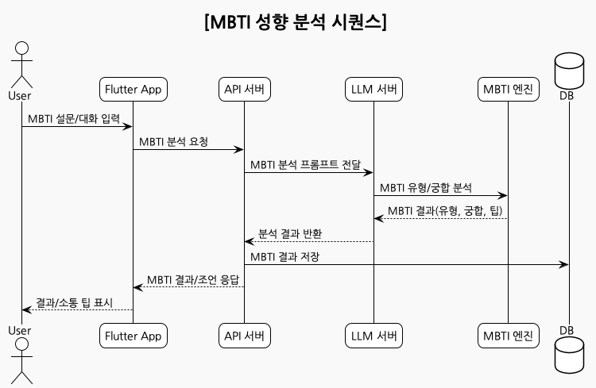

---

## 3. 소통 스타일 분석

### 주요 기능
- 직접/간접, 논리/감정, 적극/소극 등 소통 패턴 분석
- 커플 간 소통 스타일 차이 및 개선 방안 제시

### 필요 API/요소
- `POST /api/personality/analyze-communication`
- 대화 데이터 기반 소통 패턴 추출, 개선 피드백

### 시스템 시퀀스 다이어그램
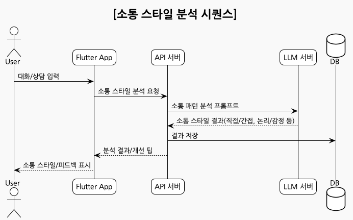

---

## 4. 사랑의 언어 분석

### 주요 기능
- 5가지 사랑의 언어(말, 행동, 선물, 시간, 스킨십) 분석
- 커플 간 호환성, 효과적 사랑 표현법 제안

### 필요 API/요소
- `POST /api/personality/analyze-love-language`
- 대화/행동 데이터 기반 사랑의 언어 추론, 결과 저장

### 시스템 시퀀스 다이어그램
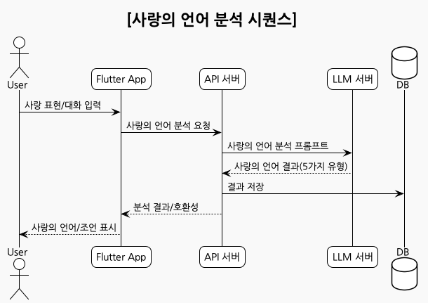

---

## 5. 성향 프로필 시스템

### 주요 기능
- 유저별 성향 정보 통합 관리
- 성향 변화 이력, 선호 활동, 관계 목표 등 기록

### 필요 API/요소
- `GET/PUT /api/personality/profile`
- 성향 정보 CRUD, 이력 관리, 추천 연동

### 시스템 시퀀스 다이어그램
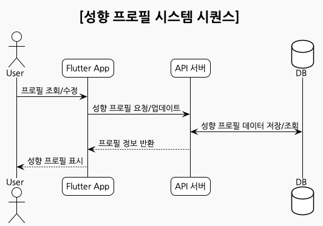

---

## 6. 관계 분석 리포트

### 주요 기능
- MBTI, 소통 스타일, 사랑의 언어 등 종합 분석
- 커플 궁합 점수, 강점/개선점, 맞춤형 조언 제공

### 필요 API/요소
- `GET /api/personality/relationship-report`
- 종합 분석 워크플로우, 리포트 생성/저장

### 시스템 시퀀스 다이어그램
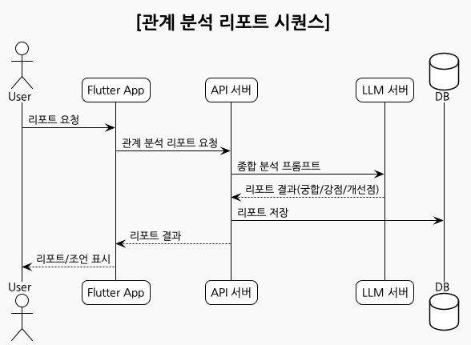

---

## 7. AI 챗봇 기반 성향 탐지

### 주요 기능
- 챗봇과의 자연스러운 대화로 성향 탐지
- 감정 상태, 행동 패턴, 관계 동적 분석

### 필요 API/요소
- `POST /api/personality/chatbot-detect`
- 대화형 프롬프트, 실시간 성향 추론, 피드백 제공

### 시스템 시퀀스 다이어그램
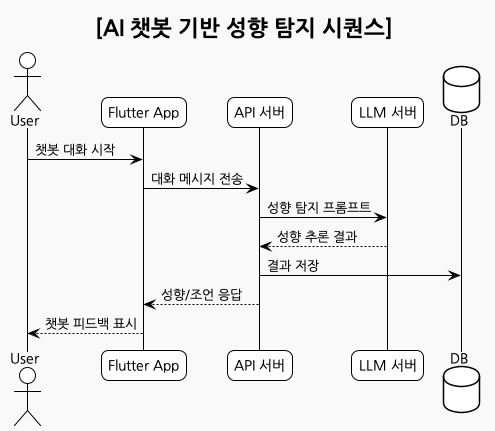

---

## 8. 행동 패턴 분석

### 주요 기능
- 앱 사용/활동 데이터 기반 간접 성향 분석
- 선호도, 참여도, 시간대별 패턴 등 추론

### 필요 API/요소
- `POST /api/personality/analyze-behavior`
- 행동 데이터 수집/분석, 추천 연동

### 시스템 시퀀스 다이어그램
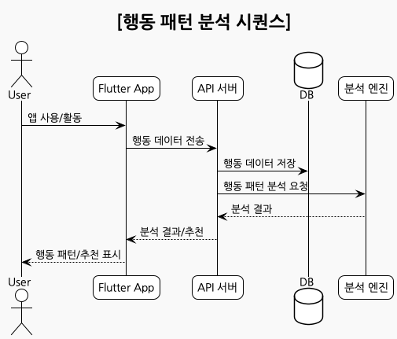

---

## 9. 감정 상태 분석

### 주요 기능
- 대화/상담에서 감정 상태 및 변화 추적
- 스트레스, 기분 변화, 감정 기반 지원

### 필요 API/요소
- `POST /api/personality/analyze-emotion`
- 감정 분석 프롬프트, 결과 저장/피드백

### 시스템 시퀀스 다이어그램
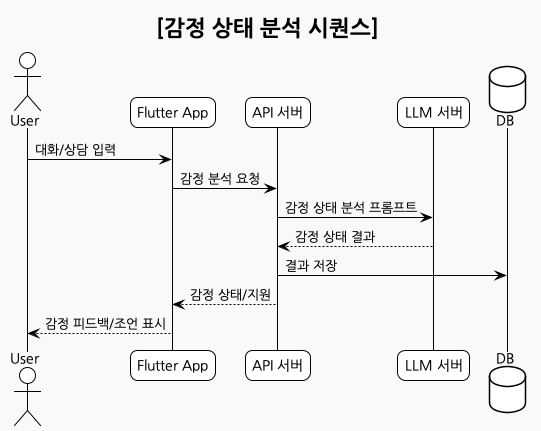

---

## 10. 성향 기반 피드백 시스템

### 주요 기능
- 실시간/정기 피드백, 성장 추천, 관계 개선 제안
- 대화/활동/리포트 기반 맞춤 피드백

### 필요 API/요소
- `POST /api/personality/feedback`
- 피드백 엔진, 추천 시스템, 결과 저장

### 시스템 시퀀스 다이어그램
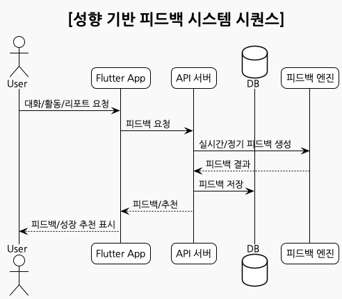

---

## 11. 기술적 구현 및 API 설계

### 공통 요소
- **프론트엔드(Flutter)**: 입력/분석 요청, 결과 표시, 프로필/리포트 UI
- **API 서버(NestJS)**: 분석 요청/결과 관리, DB 연동, 피드백/추천 엔진
- **LLM 서버(FastAPI)**: 프롬프트 생성, LLM 호출(OpenAI/Claude), 결과 파싱
- **DB(PostgreSQL)**: 성향/분석/이력/추천 데이터 저장
- **AI 서비스**: OpenAI, Claude, LangChain 등

### API 설계 예시
```http
POST /api/personality/analyze-conversation
{
  "userId": "...",
  "partnerId": "...",
  "messages": [ ... ]
}
→
{
  "personalityTraits": { ... },
  "feedback": "...",
  "score": 0.87
}
```
- 각 분석 항목별로 별도 API/엔드포인트 설계 권장

---

## 12. 데이터 흐름 및 연동

1. **데이터 수집**: 대화, 설문, 행동, 감정 등 다양한 데이터 수집
2. **분석 요청**: 프론트 → API → LLM → AI 서비스
3. **분석 결과 저장**: API 서버가 DB에 결과 저장
4. **피드백/추천 제공**: 분석 결과 기반 실시간/정기 피드백, 추천 제공
5. **프로필/리포트 관리**: 유저별 성향/이력/리포트 통합 관리

---

## 13. 시스템 통합 아키텍처

SAIONDO의 성향 분석 시스템은 다음과 같은 통합 아키텍처로 구성됩니다:

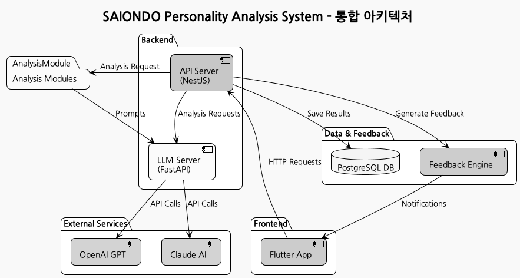

### 🏗️ 아키텍처 구성 요소

#### **Frontend Layer (Flutter App)**
- **사용자 인터페이스**: 직관적이고 반응형 UI/UX
- **성향 분석 요청**: 다양한 분석 모듈에 대한 요청 처리
- **결과 표시**: 분석 결과를 시각적이고 이해하기 쉽게 표현
- **프로필 관리**: 사용자 성향 정보 및 이력 관리

#### **API Gateway Layer (NestJS)**
- **요청 라우팅**: 각 분석 모듈로의 요청 분배
- **인증/인가**: 사용자 권한 검증 및 보안 관리
- **데이터 검증**: 입력 데이터의 유효성 검사
- **응답 포맷팅**: 일관된 API 응답 형식 제공

#### **AI Analysis Layer (FastAPI)**
- **프롬프트 생성**: 각 분석 유형에 맞는 최적화된 프롬프트 생성
- **LLM 호출 관리**: OpenAI, Claude 등 외부 AI 서비스 연동
- **결과 파싱**: AI 응답을 구조화된 데이터로 변환
- **에러 처리**: AI 서비스 장애 시 대체 로직 및 복구

#### **Personality Analysis Modules**
- **MBTI Analysis**: 16가지 성향 유형 분류 및 궁합 분석
- **Communication Style**: 소통 패턴 및 스타일 분석
- **Love Language**: 5가지 사랑의 언어 분석
- **Emotion Analysis**: 감정 상태 및 변화 추적
- **Behavior Pattern**: 사용자 행동 패턴 분석

#### **External AI Services**
- **OpenAI GPT**: 고성능 언어 모델 활용
- **Claude AI**: 대안 AI 서비스로 안정성 확보
- **LangChain**: 프롬프트 관리 및 워크플로우 최적화

#### **Data Layer (PostgreSQL)**
- **사용자 프로필**: 개인별 성향 정보 저장
- **분석 결과**: 각 분석 모듈의 결과 데이터
- **대화 이력**: 성향 분석을 위한 대화 데이터
- **피드백 데이터**: 사용자 피드백 및 개선 사항

#### **Feedback System**
- **실시간 피드백**: 즉시적인 분석 결과 및 조언 제공
- **정기 리포트**: 주간/월간 성향 변화 및 관계 분석
- **추천 엔진**: 개인화된 활동 및 개선 방안 제안

### 📊 데이터 흐름

1. **사용자 요청** → Flutter App에서 분석 요청
2. **API 처리** → NestJS 서버에서 요청 검증 및 라우팅
3. **AI 분석** → FastAPI 서버에서 LLM 호출 및 결과 처리
4. **데이터 저장** → PostgreSQL에 분석 결과 및 이력 저장
5. **피드백 생성** → 분석 결과 기반 맞춤형 피드백 생성
6. **결과 전달** → 사용자에게 시각화된 결과 및 조언 제공

### ✨ 시스템 특징

- **모듈화 설계**: 각 분석 모듈이 독립적으로 동작하며 확장 가능
- **실시간 처리**: 대화 기반 실시간 성향 분석 및 피드백
- **개인화**: 사용자별 맞춤형 분석 및 추천 시스템
- **확장성**: 새로운 분석 모듈 추가 시 기존 시스템에 영향 최소화
- **안정성**: 다중 AI 서비스 연동으로 서비스 안정성 확보

이 아키텍처를 통해 **개인화된 커플 케어 서비스**를 제공하며,  
각 분석 결과가 서로 연동되어 **종합적인 관계 인사이트**를 제공합니다.

---

## 14. 참고/연계 문서

- [SAIONDO 전체 아키텍처](../README.md#🚀-시스템-아키텍처-전체-구조)
- [LLM 서버 문서](../backend/llm/README.md)
- [API 서버 문서](../backend/api/README.md)
- [Flutter 앱 문서](../frontend/app/README.md)
- [LangSmith 활용 가이드](../backend/llm/docs/langsmith-guide.md)

---

## 📝 최적화/확장 팁

- 각 분석 항목별로 **API/DB/LLM/프론트**의 역할을 명확히 분리
- **프롬프트 엔지니어링**: LLM 분석 정확도 향상을 위한 프롬프트 설계
- **분석 결과 표준화**: 모든 분석 결과를 공통 포맷(JSON 등)으로 관리
- **실시간/정기 피드백**: 이벤트 기반/스케줄 기반 피드백 시스템 병행
- **모듈화/확장성**: 새로운 성향 분석 항목 추가 시, puml/코드/API 구조 일관성 유지
- **테스트/모니터링**: LangSmith 등으로 LLM 분석 품질/트레이싱 강화

---
