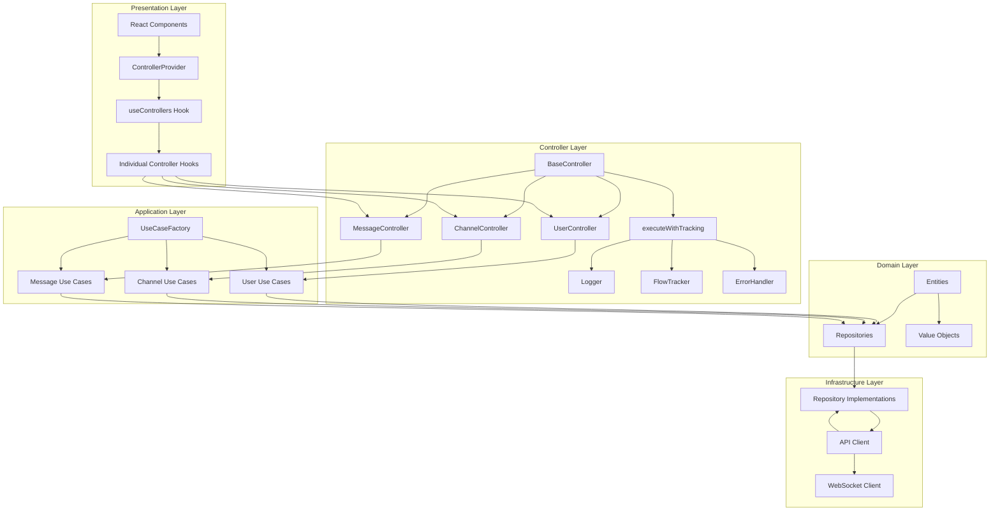
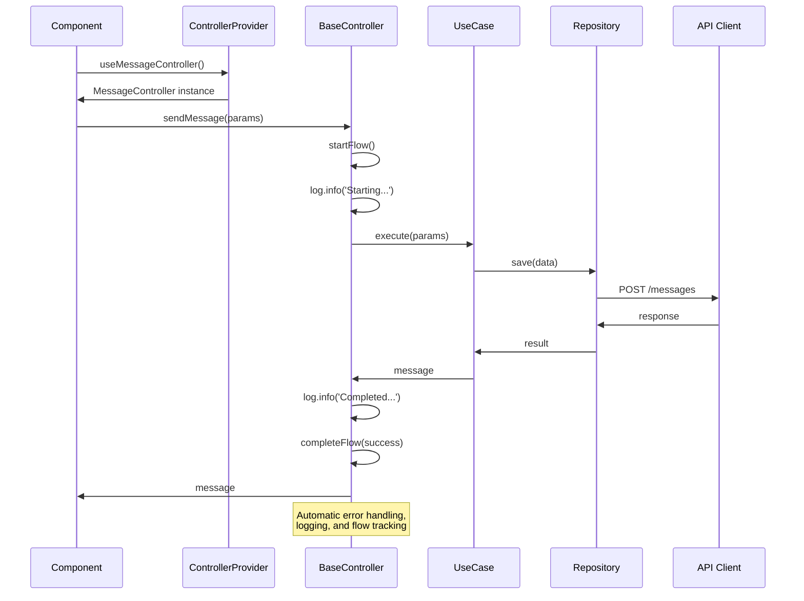
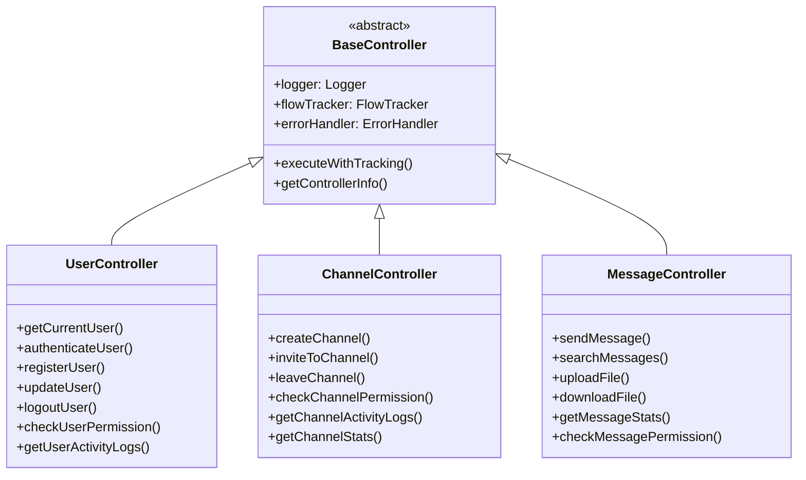
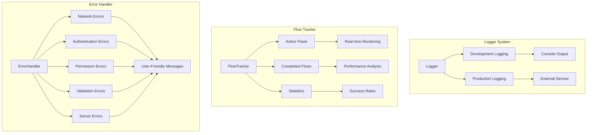
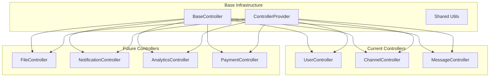

# 🏗️ Controller Pattern Architecture Diagram

## 📊 전체 아키텍처 흐름



## 🔄 데이터 흐름



## 🎯 Controller 계층 구조



## 📈 모니터링 및 추적

```mermaid
graph LR
    subgraph "Flow Tracking"
        A[Controller Operation] --> B[FlowTracker.startFlow()]
        B --> C[Generate Flow ID]
        C --> D[Track Start Time]
        D --> E[Execute Operation]
        E --> F[FlowTracker.completeFlow()]
        F --> G[Calculate Duration]
        G --> H[Update Statistics]
    end
    
    subgraph "Logging"
        I[Operation Start] --> J[Logger.info()]
        J --> K[Structured Log]
        K --> L[Console/External Service]
        
        M[Operation Complete] --> N[Logger.info()]
        N --> O[Success Log]
        
        P[Operation Error] --> Q[Logger.error()]
        Q --> R[Error Log]
    end
    
    subgraph "Error Handling"
        S[Error Occurs] --> T[ErrorHandler.handleError()]
        T --> U[Error Classification]
        U --> V[User-Friendly Message]
        V --> W[Standardized Error]
    end
```

## 🔧 유틸리티 시스템



## 🚀 확장 가능한 구조



## 📊 성능 메트릭

```mermaid
graph LR
    subgraph "Performance Tracking"
        A[Operation Start] --> B[Performance.now()]
        B --> C[Execute Operation]
        C --> D[Performance.now()]
        D --> E[Calculate Duration]
        E --> F[Store Metrics]
    end
    
    subgraph "Statistics"
        G[Average Response Time]
        H[Success Rate]
        I[Error Rate]
        J[Throughput]
        K[Active Operations]
    end
    
    F --> G
    F --> H
    F --> I
    F --> J
    F --> K
```

## 🎯 주요 특징

### ✅ 자동화된 기능
- **흐름 추적**: 모든 작업의 시작/완료/실패 자동 추적
- **로깅**: 구조화된 로그 자동 생성
- **에러 처리**: 표준화된 에러 처리 및 사용자 친화적 메시지
- **성능 모니터링**: 실행 시간 자동 측정
- **보안**: 민감한 정보 자동 마스킹

### 🔄 확장성
- **새로운 Controller 추가**: BaseController 상속으로 쉽게 확장
- **새로운 유틸리티**: Logger, FlowTracker, ErrorHandler 확장 가능
- **새로운 Hook**: ControllerProvider에 쉽게 추가

### 📈 모니터링
- **실시간 통계**: 성공률, 응답 시간, 활성 작업 수
- **성능 분석**: 병목 지점 식별
- **디버깅**: 상세한 흐름 추적으로 문제 해결 용이

### 🛡️ 안정성
- **에러 격리**: 한 Controller의 에러가 다른 부분에 영향 없음
- **자동 복구**: 일부 에러 상황에서 자동 복구 시도
- **데이터 무결성**: 트랜잭션적 작업 보장

---

이 아키텍처로 애플리케이션의 흐름 추적, 에러 처리, 로깅이 완전히 자동화되었으며, 새로운 기능 추가와 운영 모니터링이 훨씬 용이해졌습니다. 