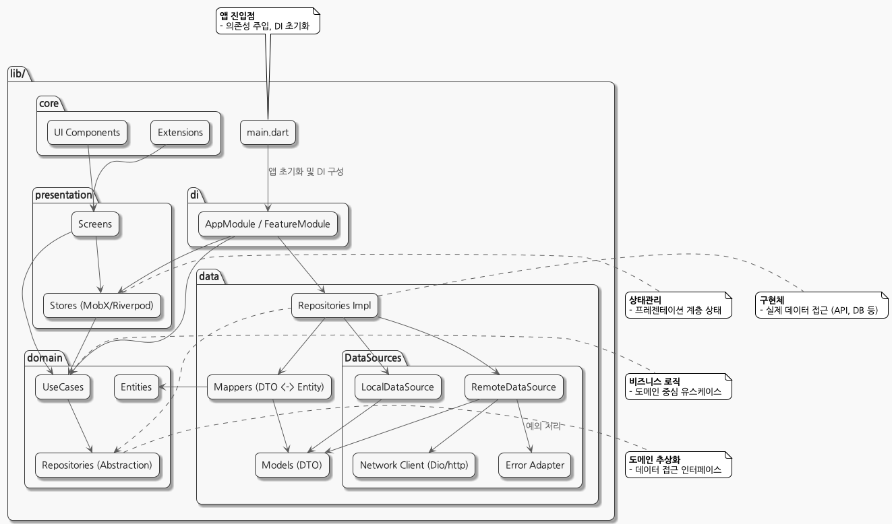

# 💑 Saiondo Flutter App

**Flutter 기반의 커플 케어 서비스 프론트엔드**  
웹/모바일/데스크탑을 지원하며, 실시간 채팅, 성향 분석, 리포트 등 다양한 기능을 제공합니다.

---

<p align="center">
  
</p>

---

## 📁 프로젝트 폴더 구조

```plaintext
app/
├── lib/
│   ├── main.dart                  # 앱 진입점
│   ├── presentation/              # UI, 화면, 위젯
│   │   └── chat/                  # 채팅 화면, 위젯, 상태관리
│   ├── domain/                    # 비즈니스 로직, 엔티티, 유스케이스, 리포지토리
│   │   ├── repository/            # 데이터 접근 추상화
│   │   ├── usecase/               # 실제 비즈니스 유스케이스
│   │   └── entry/                 # 엔티티(도메인 모델)
│   ├── data/                      # 데이터 소스, API, 모델, 네트워크
│   │   ├── network/               # API 연동, 모델, 엔드포인트
│   │   ├── apis/                  # 실제 API 호출 클래스
│   │   ├── model/                 # API 응답/요청 모델
│   │   ├── constants/             # API 엔드포인트 상수
│   │   └── dio_client.dart        # Dio 기반 HTTP 클라이언트
│   ├── core/                      # 공통 유틸, 에러, 상수 등
│   ├── di/                        # 의존성 주입
│   ├── utils/                     # 유틸리티 함수
│   ├── constants/                 # 앱 전역 상수
│   └── docs/                      # 문서/설명
├── assets/                        # 이미지, 폰트, 번역 등 리소스
├── test/                          # 단위/위젯 테스트
├── android/ ios/ macos/ linux/ windows/ web/ # 플랫폼별 코드
├── pubspec.yaml                   # 의존성/설정
├── analysis_options.yaml           # 린트/코드 스타일
└── README.md
```

---

## 🏗️ 아키텍처 및 개발 패턴

- **Clean Architecture + MVVM 패턴**
  - `presentation`(View/Widget) ↔ `domain`(UseCase/Entity/Repository) ↔ `data`(API/Model)
- **상태관리**: MobX, Provider, EventBus 등 활용
- **의존성 주입**: get_it, di 폴더
- **API 통신**: Dio 기반, RESTful 구조
- **모델/DTO**: json_serializable, freezed 등 활용
- **플랫폼별 대응**: 웹/모바일/데스크탑 지원

---

## 🧩 주요 도메인

- **인증/회원가입**: 로그인, 회원가입, 인증 상태관리
- **유저/프로필**: 사용자 정보, 프로필 편집
- **채팅/룸**: 실시간 채팅, 대화방, WebSocket 연동
- **페르소나/리포트**: 성향 분석, 리포트 조회
- **설정/네비게이션**: 앱 설정, 화면 이동, Drawer/Tab 등

---

## ⚙️ 기술 스택 및 주요 의존성

- **Flutter 3.x**
- **상태관리**: mobx, provider, event_bus
- **네트워크**: dio, http, socket_io_client, web_socket_channel
- **로컬저장소**: shared_preferences, sembast
- **UI/UX**: google_fonts, awesome_dialog, curved_navigation_bar 등
- **유틸/기타**: get_it(의존성), intl(다국어), uuid, logger, validators
- **코드 생성**: build_runner, json_serializable, mobx_codegen, freezed
- **테스트**: flutter_test

> 주요 의존성은 [`pubspec.yaml`](./pubspec.yaml) 참고

---

## 🚀 개발/실행/배포

1. **의존성 설치**
   ```sh
   fvm flutter pub get
   ```
2. **로컬 실행(웹)**
   ```sh
   fvm flutter run -d chrome
   ```
3. **빌드(웹)**
   ```sh
   fvm flutter build web
   ```
4. **환경변수 포함 빌드**
   ```sh
   ./build_web_env.sh
   # 예시: flutter build web --dart-define=webApiKey=... --dart-define=webAppId=...
   ```
5. **Firebase Hosting 배포**
   ```sh
   ./build_web_env.sh
   firebase deploy --only hosting
   ```

### Docker로 실행

- (별도 Dockerfile 미포함, 필요시 flutter web build 후 Nginx 등으로 서빙)

---

## 🧪 테스트

- **단위/위젯 테스트**
  ```sh
  flutter test
  ```

---

## 🛠️ 주요 명령어

- **코드 생성(json_serializable, mobx 등)**
  ```sh
  fvm flutter pub run build_runner build
  fvm dart run build_runner build --delete-conflicting-outputs
  ```
- **로컬 실행(웹)**
  ```sh
  fvm flutter run -d chrome
  ```
- **환경변수 포함 실행**
  ```sh
  ./run_web_with_env.sh
  ```
- **Firebase 배포**
  ```sh
  firebase deploy --only hosting
  ```

---

## 🛡️ Trouble Shooting

| 문제/이슈 | 해결 방법 |
|-----------|-----------|
| 빌드/런타임 에러 | 의존성 충돌 시 `flutter clean`, `pub get` 재실행 |
| 코드 생성 오류 | build_runner, json_serializable, freezed 버전 확인, --delete-conflicting-outputs 옵션 활용 |
| 환경변수 미적용 | --dart-define 옵션 확인, .env 파일/스크립트 활용 |
| 웹소켓/네트워크 오류 | API 서버 주소, CORS, 네트워크 상태 확인 |
| 플랫폼별 이슈 | 각 플랫폼별 폴더/설정/권한 확인 |

---

## 🏗️ 기여/확장

- 새로운 도메인/화면 추가: `lib/presentation/`, `lib/domain/`, `lib/data/`에 구조 맞춰 추가
- 모델/DTO 추가: `json_serializable`, `freezed` 기반으로 생성
- 상태관리/의존성: MobX, get_it 등 활용
- 테스트 코드 작성: `test/` 폴더에 단위/위젯 테스트 추가

---

## 📚 문서 & 운영 가이드

- [Android 빌드/배포/Flavor 가이드](./docs/aos-build-run.md)
- [iOS 빌드/배포/Flavor 가이드](./docs/ios-build-run.md)

> **운영/배포/플랫폼별 상세 가이드는 위 docs/ 하위 md 파일들을 참고하세요!**

---

## 🌍 기타

- **다국어 지원**: assets/lang, intl 패키지 활용
- **커스텀 폰트**: assets/fonts, google_fonts
- **환경별 빌드/배포**: --dart-define, build_web_env.sh 등 활용
- **문서/설명**: `lib/docs/` 참고

---

## 📝 Best Practice & 운영 팁

- **환경변수/시크릿 관리**: `.env.dev`, `.env.prod` 등 분리, `.gitignore`에 반드시 추가
- **빌드/배포 자동화**: GitHub Actions, Codemagic 등 CI/CD 활용 추천
- **플랫폼별 앱 아이콘/이름/설정 분리**: dev/prod 구분 명확히
- **릴리즈 전 실제 디바이스/브라우저 테스트 필수**
- **Flutter, 패키지, 정책 최신화 주기적 확인**
- **문서/스크립트 최신화**: 운영 중 발견된 이슈/팁은 docs/에 바로 반영

---
